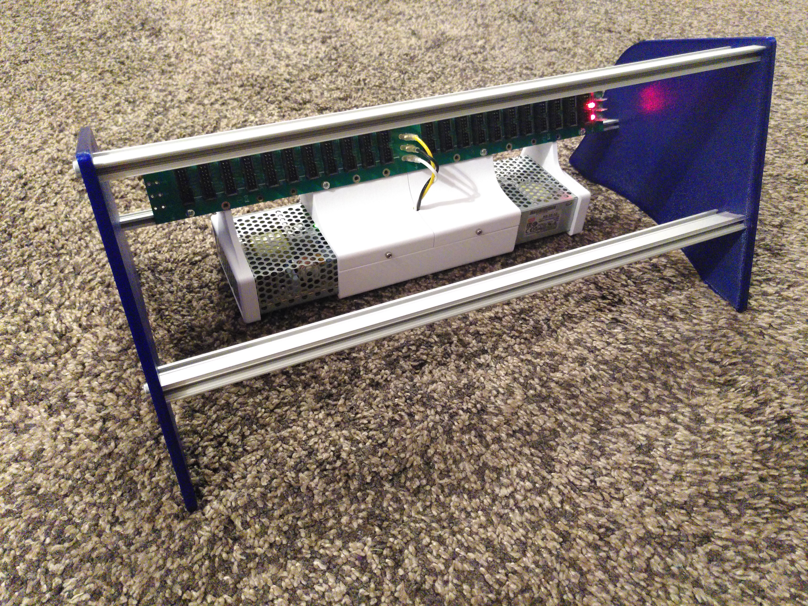
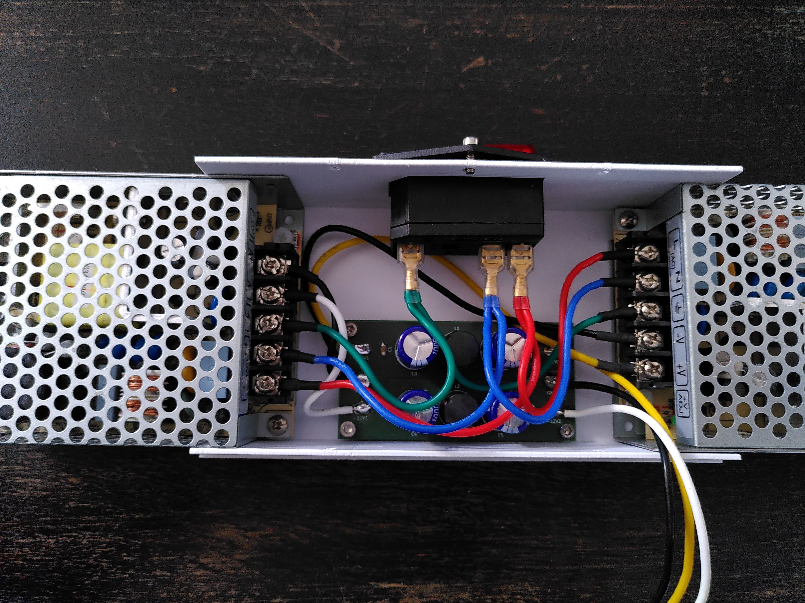
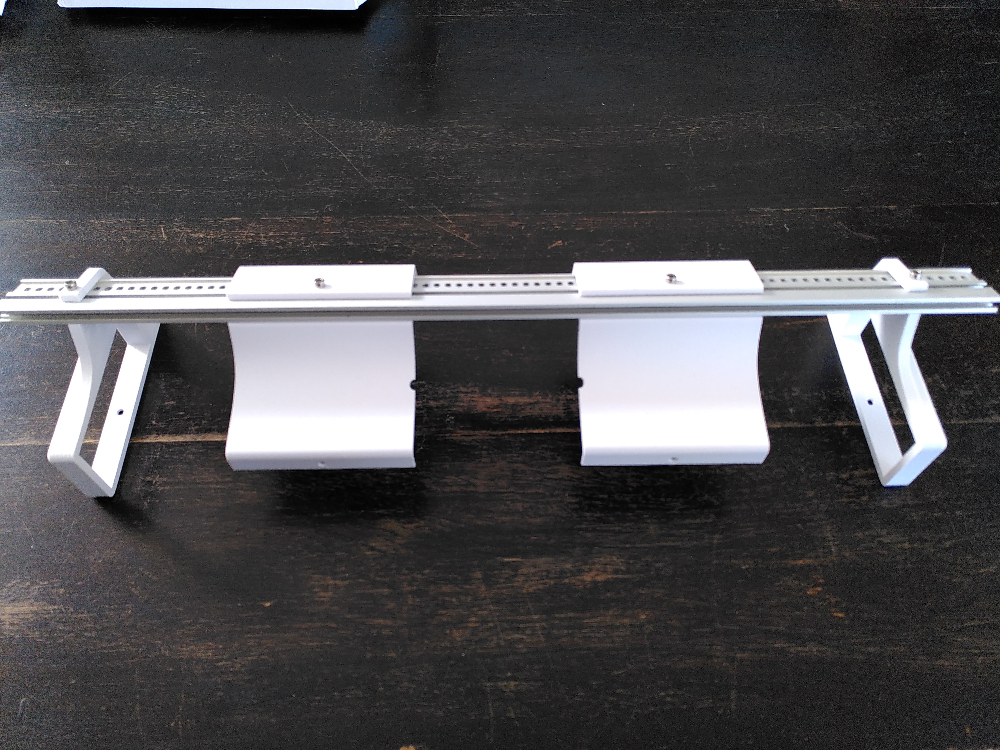
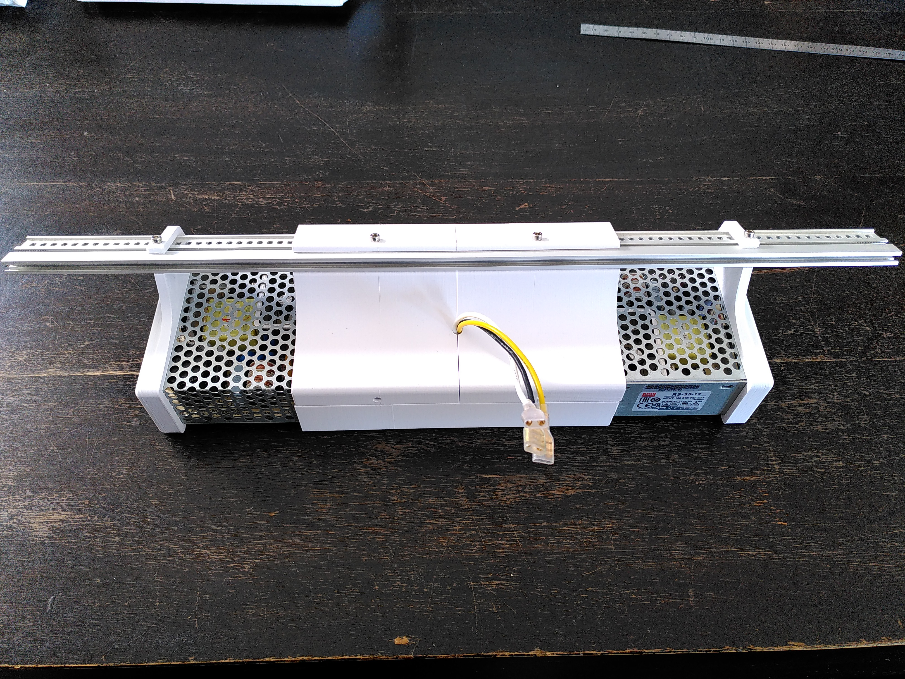
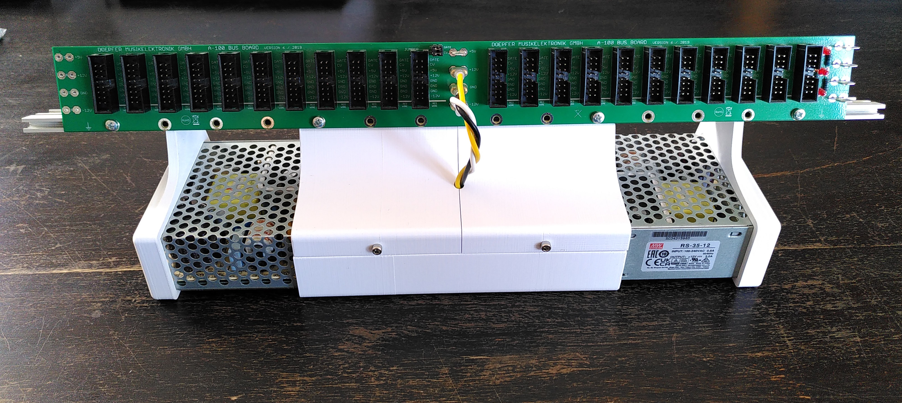
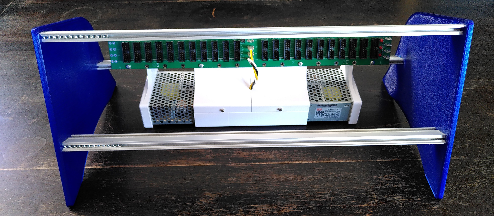
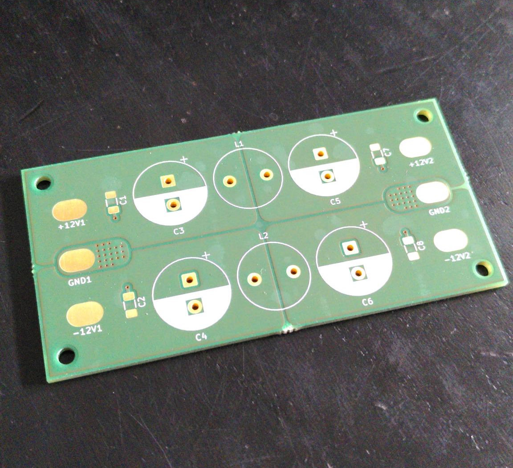
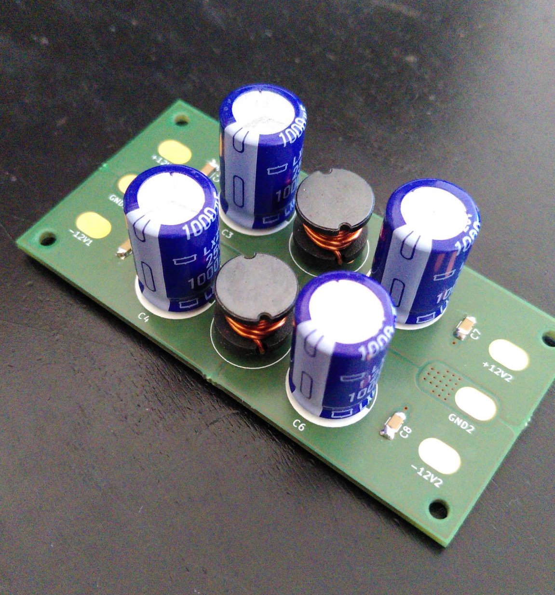

# budget-eurorack-case-and-PSU #
This repo contains all files to build your own budget 84HP Eurorack case with intrgrated bus board, PSU and an optional filter PCB.  

I made this, because of my limited budget as a student, I could not afford 250+€ 84HP cases and power supplies. Also I liked the idea to build stuff myself :)  

The case features two MeanWell PSUs, each of which supplies up to 3 A. This should be more than enough for a 84 HP case. Only +-12 V supplies, no +5 V.  
The cost is about 150 € max. Less, if you already have some cables and screws.

To dampen some of the PSU output voltage spikes, I designed a custom filter PCB. It offers one pi-filter per PSU (see schematic).  
Also works well on prototyping board instead of the PCB.

## BOM Case ## 
|Part  |Quantity  |Price  (Feb. 2026)  | Link |
|------|----------|--------------------|------|
| Mean Well RS-35-12 PSU | 2 | 13.36 € | [DigiKey](https://www.digikey.de/en/products/detail/mean-well-usa-inc/RS-35-12/7706181) |
| Doepfer Bus board V6 | 1 | 40 € | [Schneidersladen](https://schneidersladen.de/en/doepfer-a-100-bus-board-v6) |
| 84HP eurorack rails with lip | 2 | 9 € | [Schneidersladen](https://schneidersladen.de/en/divers-sb-rail-19-with-lip) |
| 84 HP eurorack rails without lip | 1 | 10 € | [Schneidersladen](https://schneidersladen.de/en/divers-sb-rail-19-without-lip) |
| M3 slider nuts| 1 | 10 € | [Nuts - Schneidersladen](https://schneidersladen.de/en/frap-tools-sliding-nuts-100-pcs) |
| Module Screws | 1 | 6 € | [Schneidersladen](https://schneidersladen.de/en/frap-tools-m3x6-philips-panhead-screws-silver-100-pieces) |
| M5x25 or M5x20 socket head screws | 6 | Included with rails if you order from Schneidersladen | [Amazon](https://a.co/d/07VXTLld) |
| | | ~ 8.00 € otherwise | |
| M3x6 socket head screw | 6 | | | 
| M3x5 button head screw | 2-8 | | |
| AC Cold appliances built-in plug | 1 | ~ 8 € | [Amazon](https://amzn.eu/d/06RYOiwI) |
| 0.75 mm²/18 AWG silicone cable | 1 m | 13 € | [Amazon](https://amzn.eu/d/0fPG9uPr) |
| Insulated cable lugs | 1 | 7 € | [Amazon](https://amzn.eu/d/0cKYAwAh) |
| Fork wire terminals | 1 | 7 € | [Amazon](https://amzn.eu/d/0jiY2vDV) |
| 3D-printed parts | | 3 | |
| some heatshrink tubing | | | |
| SUM | | ~ 150 € worst case | |  

## BOM Filter PCB ##
|Part  |Quantity  |Price  (Feb. 2026)  | Link |
|------|----------|--------------------|------|
| Low ESR electrolytic caps 1000 µF | 4 | 0.5 € | [reichelt](https://www.reichelt.com/de/en/shop/product/elko_radial_1000_f_25_v_105_low_esr_12_5x20_mm_rm_5-166391?search=RAD%2520LXZ%252025%252F1K0B&)|
| Ceramic caps 100 nF | 4 | 0.1 € | [reichelt](https://www.reichelt.com/de/en/shop/product/smd_multilayer_ceramic_capacitor_100_n_10_-22889?search=X7R-G1206%2520100n&) |
| Ferrite core inductor 10 μΗ | 2 | 1 € | [reichelt](https://www.reichelt.com/de/en/shop/product/vertical_inductor_09hcp_ferrite_10_h-138644?country=de&CCTYPE=private&LANGUAGE=en) |
| Custom PCB or prototyping board | 1 | ~15 € if you have the PCB manufactured | |
| SUM | | ~ 20 € | |

## Build Instructions

### Case

> [!CAUTION]
> This build requires cabling of mains power. Only work with mains voltage, if you know what you are doing!  
> Improper handling can cause electric shock, fire, or death. No liability is accepted for damage or injury.

1. The build starts with the cabling. The wire colors correspond to the colors I used in my build and can be seen in the photos.
  1. Use the fork wire terminals to,connect the mains L (red), P (blue) and PE (green) terminals form the AC cold appliance socket with the respective terminals on both PSUs. The PSUs should be  connected to mains **in parallel**. You need to squeeze two cables into one cable lug.
  2. To get +-12 V outputs, the `-V` terminal of one of the PSUs is connected to the `+V` terminal of the other one. This node is the ground rail for the +-12 V outputs. I soldered both GND cables (black) onto the PCB's GND pad. If you don't use the PCB, directly crimp the bus board connector.
  3. The remaining `+V` output is the +12 V rail (yellow), and the remaining `-V` output is the -12 V rail (white). Either connect them to the PCB or crimp the connectors for the bus board directly.
  4. If you use the PCB, solder the cables on the output side and crimp the bus board connectors.

2. Once the cabling is done, put everything together in the PSU case. Fix the PSUs to the case with the two screws on the bottom side. **Use short screws (<= 5mm) for this or you risk pushing the screw against the PCB inside the PSU!**

3. Attach the lid parts and the rib parts to the rail **without lip**. Use some of the screws and slider nuts for later fixing the position of the parts on the rail. 

4. Attach the bus board to the rails with slider nuts. Put the ends of the PSUs into the ribs. Close everything up. Attach the side panels and the other rails and you're done!

### PCB

The soldering process is quite straight forward (it's only 10 components). I went for solder pads instead of terminal blocks to prevent the contact resistance.Because of the big copper planes, for soldering the wires, I had to turn my soldering iron up to 450 °C.

